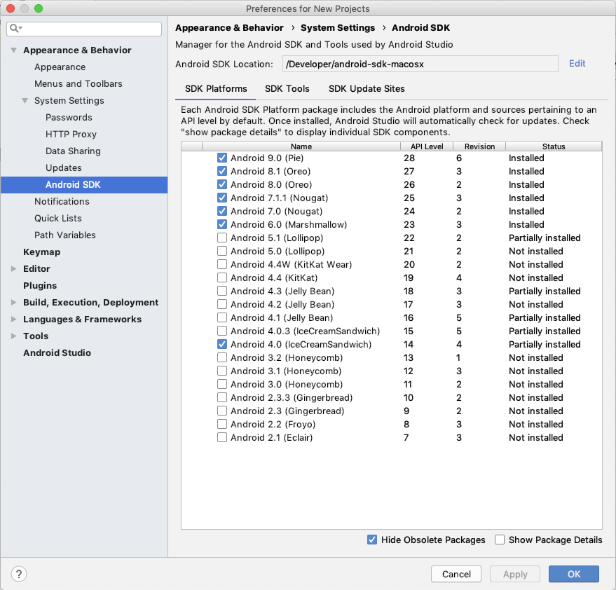
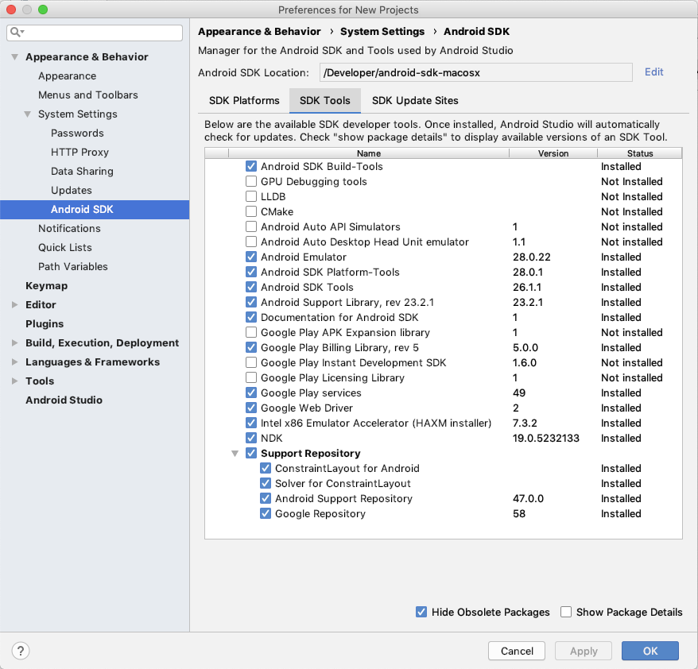

Building CounterCloud
=====================
These instructions are for building the app from a mac as of January 2019.  
Unless otherwise noted, install the latest version of each tool.  
  
Versions Specifics as of this writing:
~~~
Android Studio 3.3
Build #AI-182.5107.16.33.5199772, built on December 24, 2018
JRE: 1.8.0_152-release-1248-b01 x86_64
JVM: OpenJDK 64-Bit Server VM by JetBrains s.r.o
macOS 10.14.2
git version 2.7.1
Gradle version: 4.6
Android Plugin version: 3.2.1
~~~

Development Environment Setup
-----------------------------
1. Install AndroidStudio, Git and Java  
1. Install Android SDK 9.0 (Pie)  
1. Install Android SDK Build-Tools 
1. Install Android Android SDK Platform-Tools 28.0.1  
1. Install Android Android SDK Tools 26.1.1  
1. Install Git  

Source Checkout and Build 
-------------------------
1. From the AndroidStudio GUI, File - New - Project From Version Control - Git  
1. URL: git@github.com:Nuvolect/CounterCloud-Android.git  
1. Directory: SecureSuite-Android
1. Select **Test** and if all is well, select **Clone**, Do not add new files to Git  
1. Select Build - Make Project  

A **debug** Build Variant will be created by default.  
+ Select Run - Run 'CounterCloud' and you will be prompted to select a 
Connected Device or a Virtual Device.  
+ If you have difficulties with Gradle, use the version specified above.
To change Gradle, Select File - Project Structure - Project

Release Build Variant
---------------------
Keystore properties are not stored inside the project or inside the scope of git, 
instead the properties are stored in the .gradle configuration folder. 
This approach allows you to keep release information for multiple projects
in a single file without worry of accidentially pushing this information into Git.

     def keystorePropertiesFile = System.getProperty("user.home")+"/.gradle/keystore.properties"
     
You will need to create a 'keystore.properties' file configured as follows:
~~~
CC_keyAlias=your_alias
CC_storeFile=/Users/your_home_directory/your_keystore_folder/your_keystore
CC_storePassword=your_password
CC_keyPassword=your_password
~~~

Regression Tests
----------------  
TODO

AndroidStudio Setup Reference
-----------------------------
  

  
